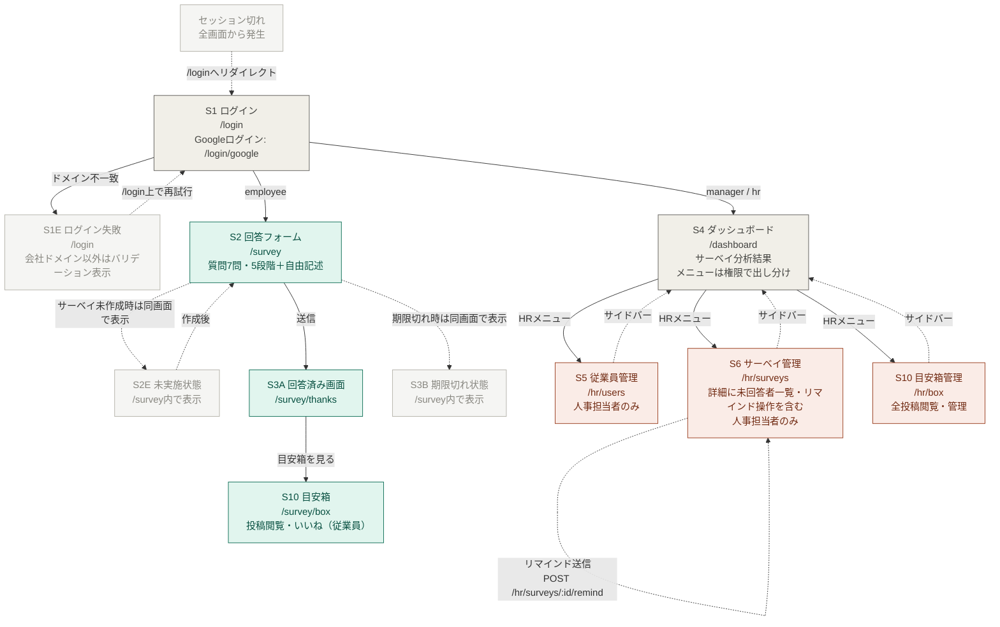

# PULSEEE 設計ドキュメント

---

## URL設計

### 基本方針

- RESTfulに沿った設計
- ロールによるアクセス制御はURLではなくサーバー側で行う
- 従業員は常に「今週のサーベイ」に自動解決される `/survey` にアクセスする
- ダッシュボードは `/dashboard` に統一し、権限ごとの差分はサーバー側で出し分ける
- HR専用の管理機能は名前空間（`/hr/`）で分離する
- ネストは2階層まで

---

### URL一覧

#### 認証

| 画面             | URL                         | メソッド | 備考                 |
| ---------------- | --------------------------- | -------- | -------------------- |
| S1 ログイン      | `/login`                    | GET      | ログイン導線         |
| S1 Googleログイン | `/login/google`             | POST     | Googleアカウントでログイン |
| S1E ログイン失敗 | `/login`                    | GET      | ドメイン不一致などをバリデーションメッセージで表示 |
| ログアウト       | `/logout`                   | DELETE   | セッション破棄       |

#### 従業員向け

| 画面              | URL                   | メソッド | 備考                          |
| ----------------- | --------------------- | -------- | ----------------------------- |
| S2 回答フォーム   | `/survey`             | GET      | 今週のサーベイに自動解決。未実施・期限切れも同画面で表示 |
| S2 回答送信       | `/survey`             | POST     | 送信完了後 S3A へリダイレクト |
| S3A 回答済み      | `/survey/thanks`      | GET      | 送信後リダイレクト先          |
| S10 目安箱        | `/survey/box`         | GET      | アンケート回答フロー内        |
| S10 目安箱投稿    | `/survey/box`         | POST     |                               |

#### ダッシュボード

| 画面              | URL          | メソッド | 備考                                      |
| ----------------- | ------------ | -------- | ----------------------------------------- |
| S4 ダッシュボード | `/dashboard` | GET      | ロール: manager / hr。メニューは権限で出し分け |

#### 人事担当者向け

| 画面                    | URL                                | メソッド | 備考                   |
| ----------------------- | ---------------------------------- | -------- | ---------------------- |
| S5 従業員一覧           | `/hr/users`                    | GET      |                        |
| S5 従業員追加フォーム   | `/hr/users/new`                | GET      |                        |
| S5 従業員作成           | `/hr/users`                    | POST     |                        |
| S5 従業員編集フォーム   | `/hr/users/:id/edit`           | GET      |                        |
| S5 従業員更新           | `/hr/users/:id`                | PATCH    | ロール・有効無効の変更 |
| S6 サーベイ一覧         | `/hr/surveys`                      | GET      |                        |
| S6 サーベイ作成フォーム | `/hr/surveys/new`                  | GET      |                        |
| S6 サーベイ保存         | `/hr/surveys`                      | POST     |                        |
| S6 サーベイ詳細         | `/hr/surveys/:id`                  | GET      | 未回答者一覧・リマインド送信操作を表示 |
| S6 リマインド送信       | `/hr/surveys/:id/remind`           | POST     | S6詳細内の操作、個別 |
| S10 目安箱管理          | `/hr/box`                          | GET      | 全投稿閲覧・管理       |

---

### ルーティング

```ruby
# config/routes.rb
Rails.application.routes.draw do

  # 認証
  devise_for :users, controllers: {
    omniauth_callbacks: 'users/omniauth_callbacks'
  }
  devise_scope :user do
    get    '/login',        to: 'sessions#new'
    post   '/login/google', to: 'sessions#google'
    delete '/logout',       to: 'devise/sessions#destroy'
  end

  # ログイン後のルート振り分け
  root to: 'dashboards#redirect'
  get '/dashboard', to: 'dashboards#show', as: :dashboard

  # 従業員向け
  resource :survey, only: [:show, :create], controller: 'answers' do
    get :thanks

    resource :box, only: [:show, :create], controller: 'box'
  end

  # 人事担当者
  namespace :hr do
    resources :users, except: [:show, :destroy]

    resources :surveys, except: [:destroy] do
      post :remind, on: :member
    end

    resource :box, only: [:show], controller: 'box'
  end

end
```

---

### ログイン後のリダイレクト

ロールに応じて遷移先を振り分ける。

```ruby
# app/controllers/dashboards_controller.rb
class DashboardsController < ApplicationController
  before_action :authenticate_user!

  def redirect
    role = current_user.role

    case role
    when 'hr', 'manager' then redirect_to dashboard_path
    when 'employee' then redirect_to survey_path
    else
      Rails.logger.warn("Unexpected user role: #{role.inspect}")
      redirect_to login_path
    end
  end
end
```

---

### アクセス制御の方針

ダッシュボードは共通URLにし、表示内容やメニューを権限で出し分ける。HR専用の管理機能はサーバー側でも必ずロールチェックを行う。

```ruby
# app/controllers/dashboards_controller.rb
class DashboardsController < ApplicationController
  before_action :authenticate_user!
  before_action :require_manager_or_hr!, only: [:show]

  private

  def require_manager_or_hr!
    redirect_to survey_path unless current_user.manager? || current_user.hr?
  end
end

# app/controllers/hr/base_controller.rb
class Hr::BaseController < ApplicationController
  before_action :authenticate_user!
  before_action :require_hr!

  private

  def require_hr!
    redirect_to dashboard_path unless current_user.hr?
  end
end
```

## 画面遷移図

