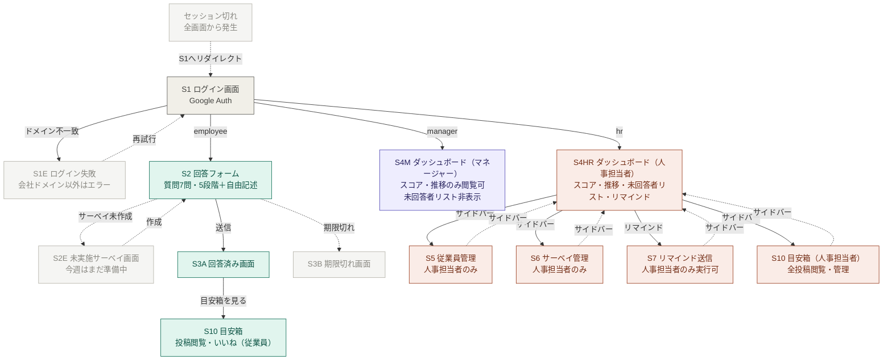

```mermaid
flowchart TD
    classDef common   fill:#F1EFE8,stroke:#5F5E5A,color:#444441
    classDef employee fill:#E1F5EE,stroke:#0F6E56,color:#085041
    classDef manager  fill:#EEEDFE,stroke:#534AB7,color:#26215C
    classDef hr       fill:#FAECE7,stroke:#993C1D,color:#712B13
    classDef error    fill:#F5F5F3,stroke:#B4B2A9,color:#888780

    S1["S1 ログイン画面\nGoogle Auth"]:::common
    S1E["S1E ログイン失敗\n会社ドメイン以外はエラー"]:::error
    SX["セッション切れ\n全画面から発生"]:::error

    S1 -- ドメイン不一致 --> S1E
    S1E -. 再試行 .-> S1
    SX -. S1へリダイレクト .-> S1

    S1 -- employee --> S2
    S1 -- manager  --> S4M
    S1 -- hr       --> S4HR

    S2["S2 回答フォーム\n質問7問・5段階＋自由記述"]:::employee
    S2E["S2E 未実施サーベイ画面\n今週はまだ準備中"]:::error
    S3A["S3A 回答済み画面"]:::employee
    S3B["S3B 期限切れ画面"]:::error
    S10_EMP["S10 目安箱\n投稿閲覧・いいね（従業員）"]:::employee

    S2 -. サーベイ未作成 .-> S2E
    S2E -. 作成 .-> S2
    S2 -- 送信 --> S3A
    S2 -. 期限切れ .-> S3B
    S3A -- 目安箱を見る --> S10_EMP

    S4M["S4M ダッシュボード（マネージャー）\nスコア・推移のみ閲覧可\n未回答者リスト非表示"]:::manager

    S4HR["S4HR ダッシュボード（人事担当者）\nスコア・推移・未回答者リスト・リマインド"]:::hr
    S5["S5 従業員管理\n人事担当者のみ"]:::hr
    S6["S6 サーベイ管理\n人事担当者のみ"]:::hr
    S7["S7 リマインド送信\n人事担当者のみ実行可"]:::hr
    S10_HR["S10 目安箱（人事担当者）\n全投稿閲覧・管理"]:::hr

    S4HR -- リマインド --> S7
    S4HR -- サイドバー --> S5
    S4HR -- サイドバー --> S6
    S4HR -- サイドバー --> S10_HR
    S5 -. サイドバー .-> S4HR
    S6 -. サイドバー .-> S4HR
    S7 -. サイドバー .-> S4HR
    S10_HR -. サイドバー .-> S4HR
```
