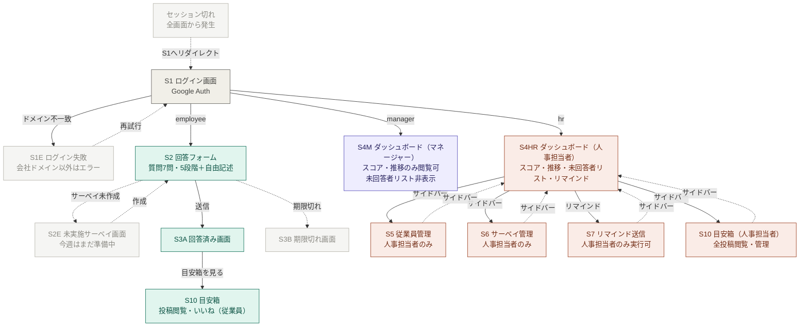

# PULSEEE 設計ドキュメント

---

## URL設計

### 基本方針

- RESTfulに沿った設計
- ロールによるアクセス制御はURLではなくサーバー側で行う
- 従業員は常に「今週のサーベイ」に自動解決される `/survey` にアクセスする
- 管理系URLは名前空間（`/hr/` `/manager/`）で分離する
- ネストは2階層まで

---

### URL一覧

#### 認証

| 画面             | URL                            | メソッド | 備考               |
| ---------------- | ------------------------------ | -------- | ------------------ |
| S1 ログイン      | `/auth/google_auth2`           | GET      | OmniAuth起動       |
| S1 コールバック  | `/auth/google_auth2/callback`  | GET      | 認証後リダイレクト |
| S1E ログイン失敗 | `/auth/failure`                | GET      | ドメイン不一致など |
| ログアウト       | `/auth/sign_out`               | DELETE   | Devise             |

#### 従業員向け

| 画面            | URL                   | メソッド | 備考                          |
| --------------- | --------------------- | -------- | ----------------------------- |
| S2 回答フォーム | `/survey`             | GET      | 今週のサーベイに自動解決      |
| S2 回答送信     | `/survey`             | POST     | 送信完了後 S3A へリダイレクト |
| S3A 回答済み    | `/survey/thanks`      | GET      | 送信後リダイレクト先          |
| S3B 期限切れ    | `/survey/expired`     | GET      | 期限切れアクセス時            |
| S2E 未実施      | `/survey/unavailable` | GET      | 今週のサーベイ未作成時        |
| S10 目安箱      | `/box`                | GET      | 従業員・人事担当者共通        |

#### マネージャー向け

| 画面               | URL                  | メソッド | 備考                 |
| ------------------ | -------------------- | -------- | -------------------- |
| S4M ダッシュボード | `/manager/dashboard` | GET      | ロール: manager のみ |

#### 人事担当者向け

| 画面                    | URL                                | メソッド | 備考                   |
| ----------------------- | ---------------------------------- | -------- | ---------------------- |
| S4HR ダッシュボード     | `/hr/dashboard`                    | GET      | ロール: hr のみ        |
| S5 従業員一覧           | `/hr/employees`                    | GET      |                        |
| S5 従業員追加フォーム   | `/hr/employees/new`                | GET      |                        |
| S5 従業員作成           | `/hr/employees`                    | POST     |                        |
| S5 従業員編集フォーム   | `/hr/employees/:id/edit`           | GET      |                        |
| S5 従業員更新           | `/hr/employees/:id`                | PATCH    | ロール・有効無効の変更 |
| S6 サーベイ一覧         | `/hr/surveys`                      | GET      |                        |
| S6 サーベイ作成フォーム | `/hr/surveys/new`                  | GET      |                        |
| S6 サーベイ保存         | `/hr/surveys`                      | POST     |                        |
| S6 サーベイ詳細         | `/hr/surveys/:id`                  | GET      |                        |
| S7 リマインド画面       | `/hr/surveys/:survey_id/reminders` | GET      |                        |
| S7 リマインド送信       | `/hr/surveys/:survey_id/reminders` | POST     | 全員または個別         |

---

### ルーティング

```ruby
# config/routes.rb
Rails.application.routes.draw do

  # 認証
  devise_for :employees, controllers: {
    omniauth_callbacks: 'employees/omniauth_callbacks'
  }
  get '/auth/failure', to: 'sessions#failure'

  # ログイン後のルート振り分け
  root to: 'dashboards#redirect'

  # 従業員向け
  get  '/survey',             to: 'answers#new',         as: :new_answer
  post '/survey',             to: 'answers#create',      as: :answers
  get  '/survey/thanks',      to: 'answers#thanks',      as: :thanks
  get  '/survey/expired',     to: 'answers#expired'
  get  '/survey/unavailable', to: 'answers#unavailable'

  # 目安箱（従業員・人事担当者共通）
  resource :box, only: [:show], controller: 'box'

  # マネージャー
  namespace :manager do
    get 'dashboard', to: 'dashboards#show'
  end

  # 人事担当者
  namespace :hr do
    get 'dashboard', to: 'dashboards#show'

    resources :employees, except: [:show, :destroy]

    resources :surveys, except: [:destroy] do
      resources :reminders, only: [:index, :create]
    end
  end

end
```

---

### ログイン後のリダイレクト

ロールに応じて遷移先を振り分ける。

```ruby
# app/controllers/dashboards_controller.rb
def redirect
  case current_employee.role
  when 'hr'       then redirect_to hr_dashboard_path
  when 'manager'  then redirect_to manager_dashboard_path
  when 'employee' then redirect_to new_answer_path
  end
end
```

---

### アクセス制御の方針

URLでロールを分離しているが、サーバー側でも必ずロールチェックを行う。

```ruby
# app/controllers/hr/base_controller.rb
class Hr::BaseController < ApplicationController
  before_action :require_hr!

  private

  def require_hr!
    redirect_to root_path unless current_employee.hr?
  end
end

# app/controllers/manager/base_controller.rb
class Manager::BaseController < ApplicationController
  before_action :require_manager_or_hr!

  private

  def require_manager_or_hr!
    redirect_to root_path unless current_employee.manager? || current_employee.hr?
  end
end
```

## 画面遷移図


