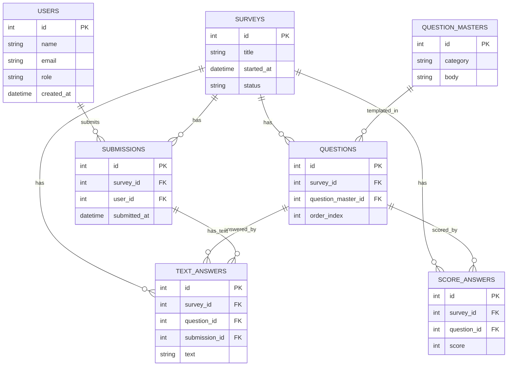

```mermaid
erDiagram

    USERS {
        int id PK
        string name
        string email
        string role
        datetime created_at
    }

    SURVEYS {
        int id PK
        string title
        datetime started_at
        string status
    }

    QUESTION_MASTERS {
        int id PK
        string category
        string body
    }

    QUESTIONS {
        int id PK
        int survey_id FK
        int question_master_id FK
        int order_index
    }

    SUBMISSIONS {
        int id PK
        int survey_id FK
        int user_id FK
        datetime submitted_at
        %% UNIQUE (survey_id, user_id)
    }

    SCORE_ANSWERS {
        int id PK
        int survey_id FK
        int question_id FK
        int score
    }

    TEXT_ANSWERS {
        int id PK
        int survey_id FK
        int question_id FK
        int submission_id FK
        string text
        %% UNIQUE (submission_id, question_id)
    }

    %% リレーション
    USERS ||--o{ SUBMISSIONS : submits
    SURVEYS ||--o{ QUESTIONS : has
    SURVEYS ||--o{ SUBMISSIONS : has
    SURVEYS ||--o{ SCORE_ANSWERS : has
    SURVEYS ||--o{ TEXT_ANSWERS : has

    QUESTION_MASTERS ||--o{ QUESTIONS : templated_in

    QUESTIONS ||--o{ SCORE_ANSWERS : scored_by
    QUESTIONS ||--o{ TEXT_ANSWERS : answered_by

    SUBMISSIONS ||--o{ TEXT_ANSWERS : has_text
```
