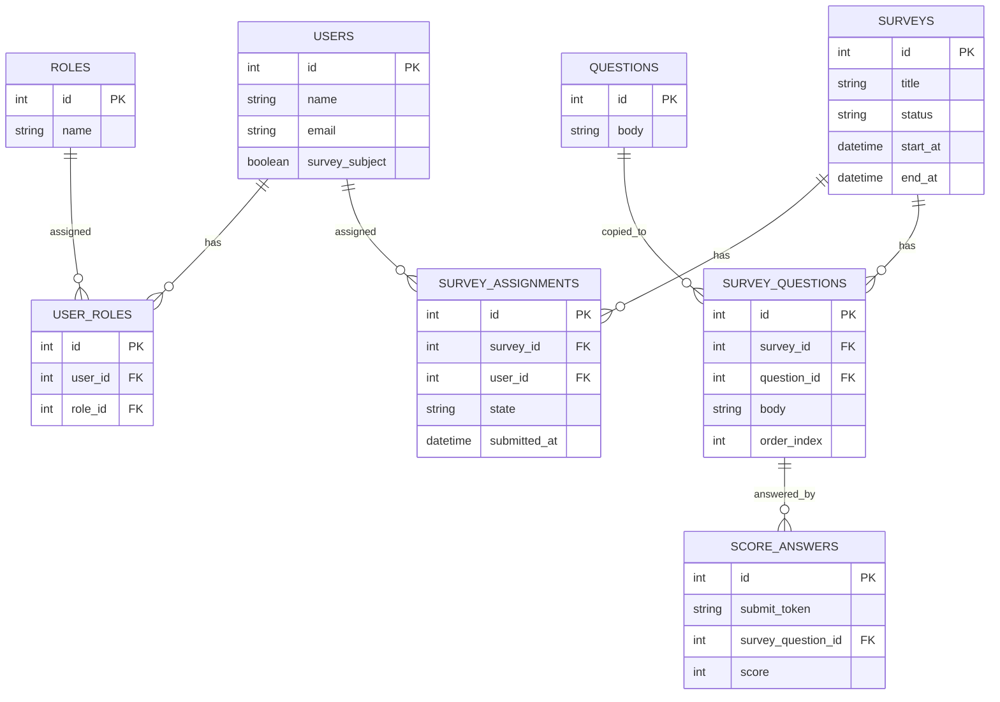

# 最初のリリースのER図

定量回答の匿名性を守るため、`SCORE_ANSWERS` は `USERS` および
`SURVEY_ASSIGNMENTS` と関連を持たず、回答時刻も保存しない。

## 制約

- `USERS.email` はユニークとする。
- `USER_ROLES` の `(user_id, role_id)` はユニークとする。
- `SURVEY_ASSIGNMENTS` の `(survey_id, user_id)` はユニークとする。
- `SURVEYS.status` は `draft` / `active` のいずれかとする。
- `SURVEY_ASSIGNMENTS.state` は `pending` / `submitted` のいずれかとする。
- `SCORE_ANSWERS.score` は `1` から `10` の整数とする。
- `SCORE_ANSWERS.submit_token` は `SURVEY_ASSIGNMENTS` に保存せず、個人の回答と結び付けない。

自由記述に用いるテーブルは、最初のリリースでは作成しない。
