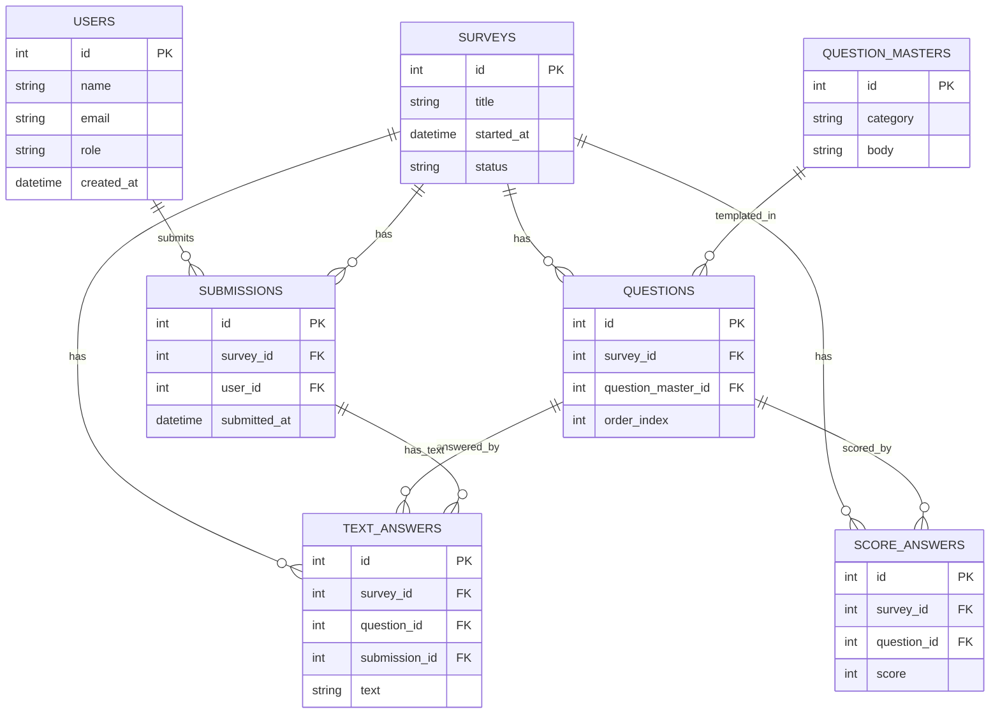

# 要件定義

## 1. サービス概要

### パルスサーベイとは

「脈拍調査」の直訳通り、短い質問（3〜5問程度）を定期的に繰り返すことで、チームや組織の「今の状態」をリアルタイムで把握する仕組み。

### 目的

- 従業員の満足度およびエンゲージメントを定量的・正確に把握し、組織運営の健全化を図る
- 従業員の変化（離職予兆・不満）をリアルタイムに検知し、問題が深刻化する前に改善サイクルを回す
- データに基づいた人事施策のアップデートを定量的に実行する
- 15名という小規模組織ゆえの「特定されるおそれ」をシステム構造で排除し、全従業員が本音を届けられるインフラを構築する

## 2. プロジェクト計画

### フェーズ1：MVPリリース

- **目標時期**: 4月中（遅くとも5月中）
- **主要機能**: アンケート回答機能、全社スコアの自動集計
- **達成目標**: 毎週（または隔週）答えるという習慣の定着と、組織のベースライン（基準値）の把握

### フェーズ2：分析・連携機能の追加

- **主要機能**: Slack連携、時系列スコアの可視化ダッシュボード、質問順番のランダム化
- **拡張機能**: 改善アクションログ（施策とスコア変化の紐付け）、目安箱

## 3. システム要件

### ① 機能要件

| 機能               | 内容                                                                                             |
| ------------------ | ------------------------------------------------------------------------------------------------ |
| 管理者機能         | 従業員の登録・管理、未回答者へのリマインド通知（誰が答えたかは判別するが、回答内容は紐付けない） |
| 回答機能           | 二重回答を防止                                                                                   |
| 分析ダッシュボード | 全社平均スコアおよびカテゴリー別スコアの推移、回収率の表示                                       |
| 目安箱             | 自由記述による要望記入欄。記名の有無を選択可能                                                   |

### ② データ設計（匿名性の担保）

回答者と回答内容を技術的に切り離すため、以下のテーブル設計を採用する。

| テーブル         | カラム                                          | 備考                                                                       |
| ---------------- | ----------------------------------------------- | -------------------------------------------------------------------------- |
| surveys          | id, title, started_at, status                   | サーベイの実施管理                                                         |
| question_masters | id, category, body                              | 再利用可能な質問テンプレ（設問文マスタ）                                   |
| questions        | id, survey_id, question_master_id, order_index  | 「どのサーベイでどの質問テンプレを何番目に出すか」を定義                   |
| submissions      | id, survey_id, user_id, submitted_at            | 回答済みチェック・リマインド用。内容は持たない。UNIQUE(survey_id, user_id) |
| score_answers    | id, survey_id, question_id, score               | 5段階などの定量スコア。**user_id / submission_id を持たない**（匿名）      |
| text_answers     | id, survey_id, question_id, submission_id, text | 自由記述・目安箱など。submission（= user × survey）に紐づく                |
| users            | id, name, email, role, created_at               | 従業員情報（管理者含む）                                                   |

> **重要**: 定量スコアは `score_answers` テーブルに保存し、ここには `user_id` / `submission_id` を一切持たない。`submissions`（誰がどのサーベイに回答したか）と `score_answers`（どの設問にいくつスコアがついたか）はDB上で切り離されており、管理者であっても個人のスコア回答を特定できない。自由記述については、`text_answers.submission_id` を通じて「誰のコメントか」を紐づけ可能とし（目安箱・個別フォロー用途）、定量スコア部分の匿名性とは役割を分ける。

### ③ 非機能要件

**セキュリティ**

- 管理者であっても個人の回答を特定できない制約。DB上での物理的分離
- 回答者数が極端に少ない場合、個人の特定を避けるためグラフや詳細数値を表示しないガードレールを設ける
  **パフォーマンス**
- Slack APIのレート制限に配慮した設計

## 4. 運用要件

### ① 設問設計

回答のマンネリ化と適当な回答を防止するため、以下の構成で運用する。

- 回答の負担を最小限に抑えつつ、表面的な実態調査にとどまらないよう、全8問（定量7問＋自由記述1問）の固定構成で運用する。
- 4つのカテゴリに沿った質問構成(①基本的なニーズ②個人の貢献③チームワーク④成長)
  ※ 質問順をランダムに入れ替えることで、慣れによる機械的クリックを防ぐ。
- 1問の自由記述（目安箱）: 業務の壁や改善要望、上司へのSOSなど。（※「特になし」でも回答可とし、心理的負担を下げる)

#### **1問の自由記述（目安箱）**

- 業務の壁や改善要望、上司へのSOSなど
- 「特になし」でも回答可とし、心理的負担を下げる

### ② フィードバックとアクション

「答えても何も変わらない」という無力感を防ぐため、以下の運用を徹底する。

- **スコア非公開**: 集計された数値は従業員には通知せず、管理者のみが閲覧する
- **「You Said, We Did」の発信**: アンケートの結果を受けて「何を決めたか」「何を変えたか」をSlackの共通チャネルで毎週（または月1回）報告する
- **クイックウィン**: 「備品の追加」や「会議ルールの変更」など、即座にできる改善を優先的に実行し、「答えれば変わる」という実感を与える

## 5. 形骸化防止策

| アラート         | 条件                                     | 対応                                                                           |
| ---------------- | ---------------------------------------- | ------------------------------------------------------------------------------ |
| 応答率アラート   | 全体の応答率が3週連続で50%を下回った場合 | 仕組み自体を再検討する                                                         |
| 改善停止アラート | アクションログが1ヶ月間更新されない場合  | 管理者はサーベイ配信を一時停止し、運用フローを修正する                         |
| メタアンケート   | 数ヶ月に1回                              | 「このサーベイはあなたに役立っていますか？」を追加し、仕組みの有効性を測定する |

## 6. 重要懸念事項

### 最大の懸念：特定されることによる回答の歪み

- 管理者自身が「誰が言ったか」よりも「システムのどこが悪いか」に集中する姿勢を明確に示す
- 「回答データとIDはDBレベルで分離されている」事実を周知し、技術的な信頼関係を構築する

### アクションの重要性

スコアを見せない代わりに、「声を出せば実際に何かが変わる（アクションがある）」ことを強調し、参加意欲を維持する。

## 7. ER図（テーブル関係）



```
users ──< submissions >── surveys ──< questions
                                   │         │
                                   ├──< score_answers （匿名スコア）
                                   └──< text_answers  （自由記述＝submissionに紐づく）
```
